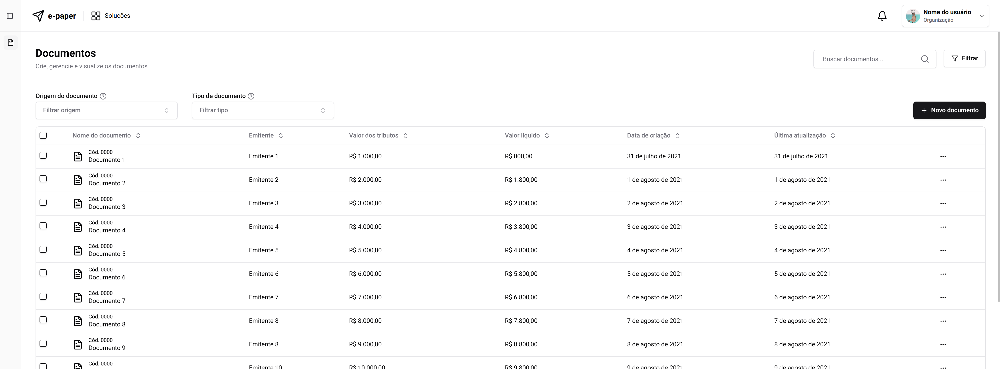
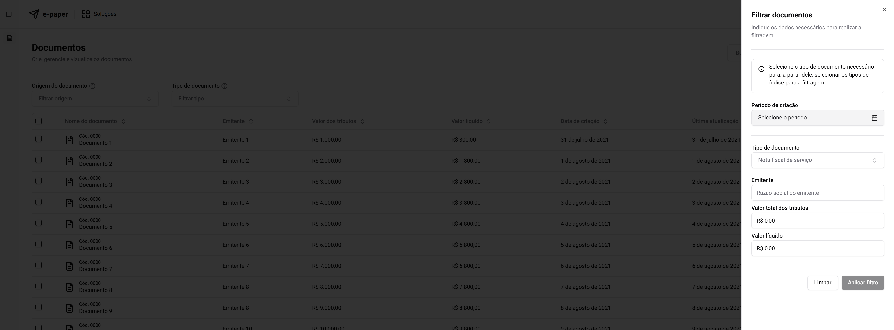
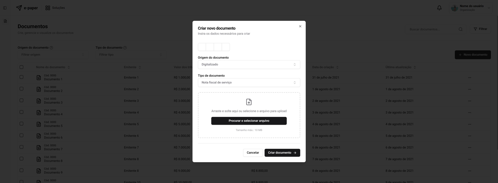
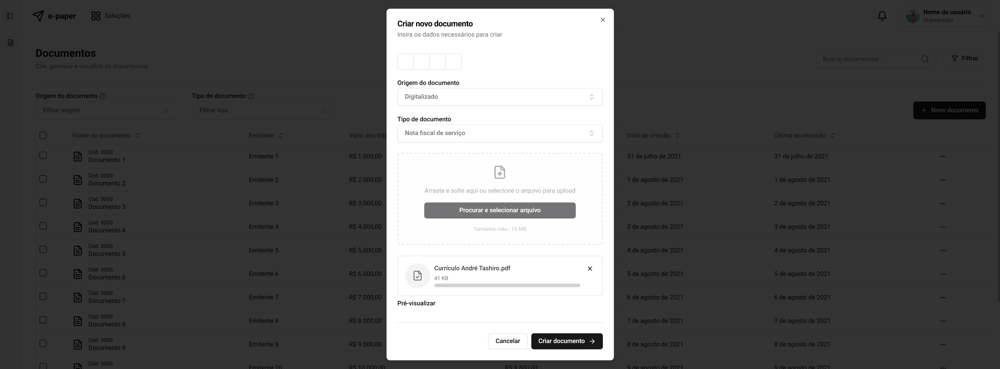

# E-paper

  
  

  
  
  
  

> Dashboard para upload de arquivos .pdf

  Gerencie seus arquivos pdf's, realizando upload de seus documentos e visualizando-os em uma dashboard moderna e fácil utilização

